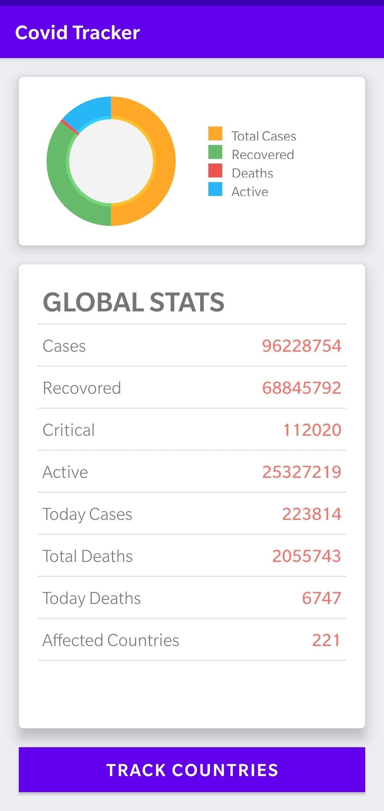
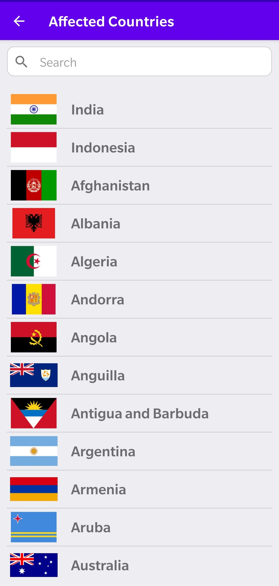
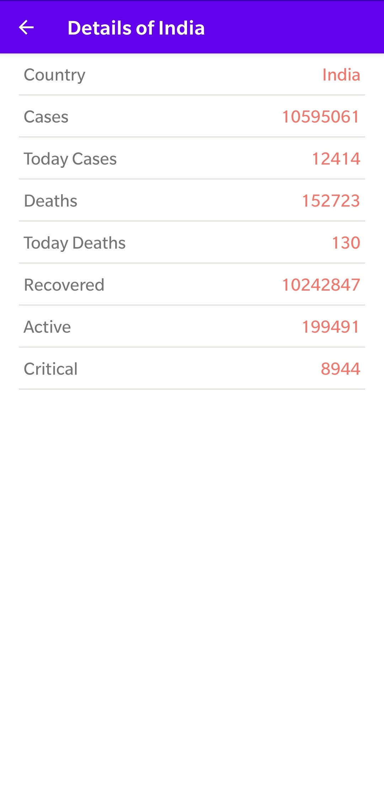

# Covid-Tracker

The app fetch real time covid data from the Corona Lamo Ninja API (https://corona.lmao.ninja/), blackfizz EazeGraph (https://github.com/blackfizz/EazeGraph) to visualization the data in a pie graph, and the Volley library for Image loading.  

The app is really simple to use and navigate, to track perticular countires simply search name of the country.

Feel free to use the source code and pull the project from here.
